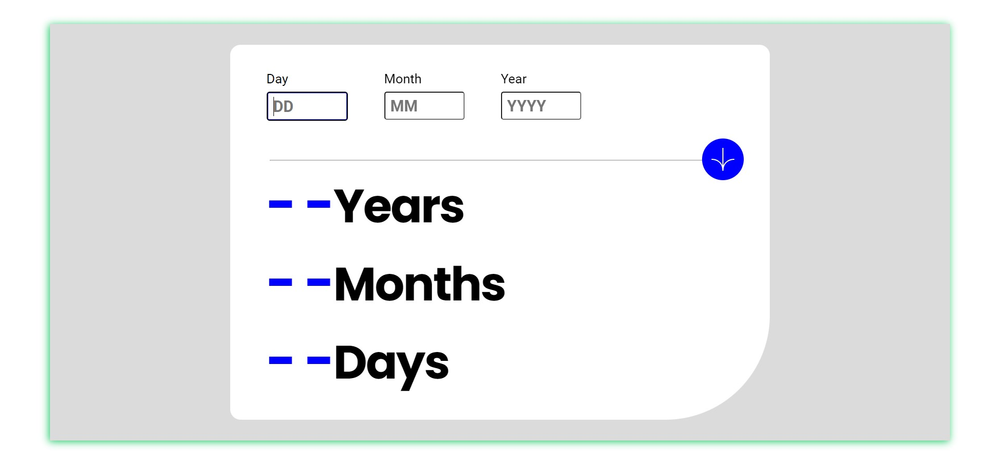

# Frontend Mentor - Age calculator app solution

This is a solution to the [Age calculator app challenge on Frontend Mentor](https://www.frontendmentor.io/challenges/age-calculator-app-dF9DFFpj-Q). Frontend Mentor challenges help you improve your coding skills by building realistic projects. 

## Table of contents

- [Overview](#overview)
  - [The challenge](#the-challenge)
  - [Screenshot](#screenshot)
  - [Links](#links)
- [My process](#my-process)
  - [Built with](#built-with)
  - [What I learned](#what-i-learned)
  - [Continued development](#continued-development)
  - [Useful resources](#useful-resources)
- [Author](#author)

## Overview

### The challenge

Users should be able to:

- View an age in years, months, and days after submitting a valid date through the form
- Receive validation errors if:
  - Any field is empty when the form is submitted
  - The day number is not between 1-31
  - The month number is not between 1-12
  - The year is in the future
  - The date is invalid e.g. 31/04/1991 (there are 30 days in April)
- View the optimal layout for the interface depending on their device's screen size
- See hover and focus states for all interactive elements on the page
- **Bonus**: See the age numbers animate to their final number when the form is submitted

### Screenshot

### Links

- Solution URL: [Github](https://github.com/Kola-Prabhas/age-calculator-app)
- Live Site URL: [Github pages](https://kola-prabhas.github.io/age-calculator-app/)

## My process

### Built with

- Semantic HTML5 markup
- CSS 
- Javascript

### What I learned

While building this project the skills that I learned are:

- Working with ***Date*** object in javascript.
- Media queries in css.

Handling Dates in javascipt was a tough task to me, but I managed to get good grasp of ***Date*** object in js.

### Continued development

The areas I want to continue focusing on in  future projects are:

- Media queries in css.
- Writing efficient code in js.

Media Queries are what make a website look attractive in devices with different screen sizes. So, I want to master to provide smooth interface across all devices.

The code I write must be optimal so that websites can load faster and can handle when the load is high. So, javascript is the one which comes into play.

### Useful resources

- [CSS Tricks](https://www.css-tricks.com) - This helped me a lot to write media queries. This is the website I go to whenever I have a doubt about any css concepts.
- [Javascript.info](https://www.javascript.info) - This website is the one I learned javascript form. I can say this is an excellent resource to learn javascript.

## Author

- Frontend Mentor - [@Kola-Prabhas](https://www.frontendmentor.io/profile/Kola-Prabhas)
- Twitter - [@kola_prabhas](https://www.twitter.com/kola_prabhas)

